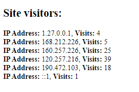

# visitor_tracker
This Visitor Tracker tool will track the IP Address of all visitors to the website and their number of visits. It will also display a log of the visitors and their number of visits. Built with PHP, HTML, and MySQL.

{width=95%}
{width=95%}